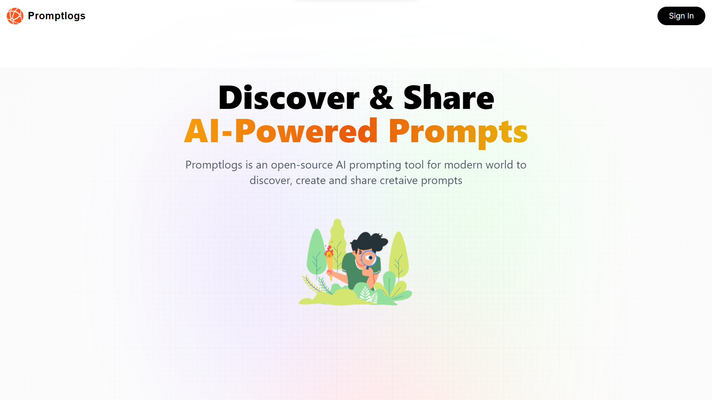
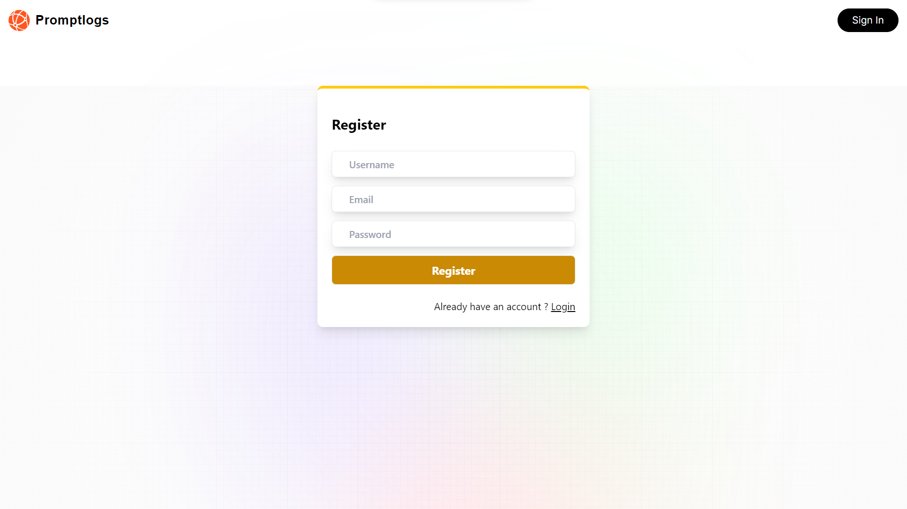
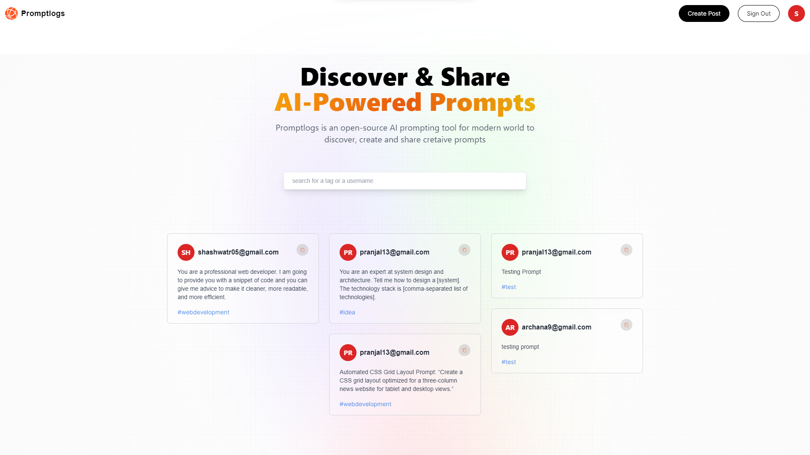
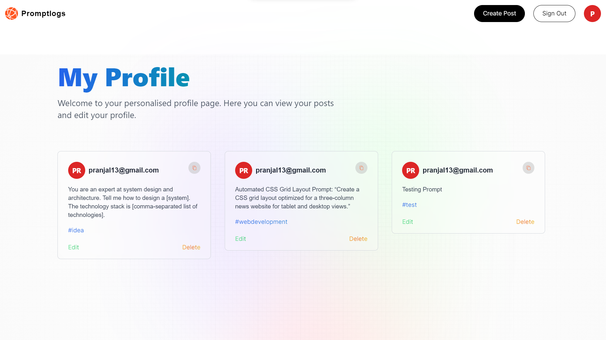

## Promptlogs

## Description
**Discover & Share AI-Powered Prompts**
Promptlogs is an open-source AI prompting tool for modern world to discover, create and share cretaive prompts.
Here you can create your profile and share helpful AI Prompts and also explore diffrent AI prompts shared by different people.

## Features
1. You can register first to see everyone's prompt and also to post your own prompt

  

2. After Signing in you can see all Prompts.

  

3. You can share your own prompt

  

4. You can visit your profile where you can see your prompts and also you can edit and delete your prompts

  

  
